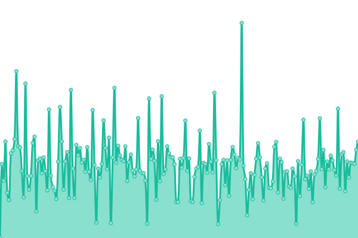

# [📈 Live Status](https://status.cephra.dev): <!--live status--> **🟧 Partial outage**

This repository contains the status page for [Cephra](https://cephra.dev), powered by [Upptime](https://github.com/upptime/upptime).

<!--start: status pages-->
<!-- This summary is generated by Upptime (https://github.com/upptime/upptime) -->
<!-- Do not edit this manually, your changes will be overwritten -->
<!-- prettier-ignore -->
| URL | Status | History | Response Time | Uptime |
| --- | ------ | ------- | ------------- | ------ |
|  [Web App](https://cephra.dev) | 🟩 Up | [web-app.yml](https://github.com/makaiachildress-web/cephra-status/commits/HEAD/history/web-app.yml) | 

 571ms
     
 | 

<a href="https://status.cephra.dev/history/web-app">100.00%</a>
    

|  [API Health](https://api.cephra.dev/health) | 🟥 Down | [api-health.yml](https://github.com/makaiachildress-web/cephra-status/commits/HEAD/history/api-health.yml) | 

 0ms
     
 | 

<a href="https://status.cephra.dev/history/api-health">100.00%</a>
    

|  [Auth (Kratos)](https://auth.cephra.dev/health/alive) | 🟥 Down | [auth-kratos.yml](https://github.com/makaiachildress-web/cephra-status/commits/HEAD/history/auth-kratos.yml) | 

 0ms
     
 | 

<a href="https://status.cephra.dev/history/auth-kratos">100.00%</a>
    

|  [Docs](https://docs.cephra.io) | 🟥 Down | [docs.yml](https://github.com/makaiachildress-web/cephra-status/commits/HEAD/history/docs.yml) | 

 0ms
     
 | 

<a href="https://status.cephra.dev/history/docs">100.00%</a>
    

<!--end: status pages-->

[**Visit our status website →**](https://status.cephra.dev)

## 📄 License

- Powered by: [Upptime](https://github.com/upptime/upptime)
- Code: [MIT](./LICENSE) © [Cephra](https://cephra.dev)
- Data in the `./history` directory: [Open Database License](https://opendatacommons.org/licenses/odbl/1-0/)
